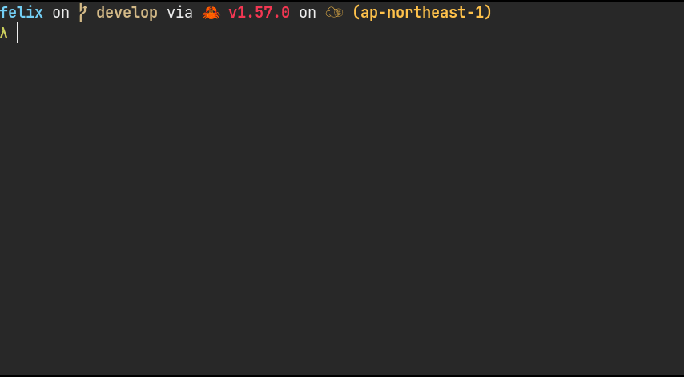

[](https://crates.io/crates/felix)


# _felix_

A tui file manager with Vim-like key mapping, written in Rust.\
Fast, simple, and easy to configure & use.

For an overview of this app, take a look at this README, especially
[key manual](#key-manual).\
For more detailed document, visit https://kyoheiu.dev/felix.

- [New release](#new-release)
- [Status](#status)
- [Installation](#installation)
- [Integrations](#integrations)
- [Usage](#usage)
  - [Key manual](#key-manual)
- [Preview feature](#preview)
- [Configuration](#configuration)



<a id="new-release"></a>

## New release

## v2.4.1 (2023-06-21)

### Changed

- Show status bar and registers even if current directory does not contain any item.

## v2.4.0 (2023-06-14)

### Added

- Add registers (unnamed, zero, numbered, named): Now you can view registers by `:reg`, and add items to registers by usual vim command (prefixed by `"`). See the key manual for more details.
- Refactor unpacking command: `e` unpacks / decompresses gz(Gzip), tar.gz, xz(lzma), tar.xz, zst(Zstandard), tar.zst, tar, and zip file format and formats based on it.

### Removed

- `:z` - Use `z` instead.

## v2.3.0 (2023-05-26)

### Changed

- Add extra config file path for macOS: `/Users/$USER/.config/felix/config.yaml` will be read after `$HOME/Library/Application Support/felix/config.yaml`.
- If config file is not found, or found one is broken, felix launches with the default configuration, without creating new one.
- If the current directory is read-only, `dd`, `Vd` and `p` is disabled in the first place.
- Bump up MSRV to 1.65.

For more details, see `CHANGELOG.md`.

<a id="status"></a>

## Status

| OS      | Status               |
| ------- | -------------------- |
| Linux   | works                |
| NetBSD  | works                |
| MacOS   | works                |
| Windows | not fully tested yet |

_For Windows users: From v1.3.0, it can be at least compiled on Windows (see
`.github/workflows/install_test.yml`.) If you're interested, please try and
report any problems._

<a id="installation"></a>

## Installation

| package    | installation command  | notes                                                                                                                                       |
| ---------- | --------------------- | ------------------------------------------------------------------------------------------------------------------------------------------- |
| crates.io  | `cargo install felix` | Minimum Supported rustc Version: **1.65.0**                                                                                                 |
| Arch Linux | `pacman -S felix-rs`  | The binary name is `felix` if you install via pacman. Alias `fx='felix'` if you want, as this document (and other installations) uses `fx`. |
| NetBSD     | `pkgin install felix` |                                                                                                                                             |

### From this repository

- Make sure that `gcc` is installed.
- MSRV(Minimum Supported rustc Version): **1.65.0**

Update Rust if rustc < 1.65:

```
rustup update
```

```
git clone https://github.com/kyoheiu/felix.git
cd felix
cargo install --path .
```

<a id="integrations"></a>

## Integrations

To be able to export your last working directory to the calling shell after exiting from `fx`,
*-- using the default `ZQ` keybinding --*, you need to add the following to your `.bashrc` or
`.zshrc` or an equivalent depending on your (POSIX) shell.
Assuming the `fx` binary can be found in your `PATH`:

```sh
source <(command fx --init)
```

In addition, you can use felix more conveniently by installing these two apps:

- [zoxide](https://github.com/ajeetdsouza/zoxide): A smarter `cd` command, which
  enables you to jump to a directory that matches the keyword in felix.
- [chafa](https://hpjansson.org/chafa/): Terminal graphics for the 21st century,
  by which you can preview images in felix. _**chafa must be v1.10.0 or
  later.**_

These apps do not need any configuration to use with felix!

<a id="usage"></a>

## Usage

_If you install this app via pacman, the default binary name is `felix`._

```
`fx` => Show items in the current directory.
`fx <directory path>` => Show items in the directory.
Both relative and absolute path available.
```

### Options

```
`--help` | `-h` => Print help.
`--log`  | `-l` => Launch the app, automatically generating a log file in `{data_local_dir}/felix/log`.
`--init`        => Returns a shell script that can be sourced for shell integration.
```

<a id="key-manual"></a>

### Key manual

```
j / Down          :Go down.
k / Up            :Go up.
h / Left          :Go to the parent directory if exists.
l / Right / Enter :Open item or change directory.
gg                :Go to the top.
G                 :Go to the bottom.
z + Enter         :Go to the home directory.
z <keyword>       :Jump to a directory that matches the keyword. (zoxide required)
o                 :Open item in a new window.
e                 :Unpack archive/compressed file.
dd                :Delete and yank item.
yy                :Yank item.
p                 :Put yanked item(s) in the current directory.
:reg              :Show registers. To hide it, press v.
"ayy              :Yank item to register a.
"add              :Delete and yank item to register a.
"Ayy              :Append item to register a.
"Add              :Delete and append item to register a.
"ap               :Put item(s) from register a.
V                 :Switch to the linewise visual mode.
  - y             :In the visual mode, yank selected item(s).
  - d             :In the visual mode, delete and yank selected item(s).
  - "ay           :In the visual mode, yank items to register a.
  - "ad           :In the visual mode, delete and yank items to register a.
  - "Ay           :In the visual mode, append items to register a.
  - "Ad           :In the visual mode, delete and append items to register a.
u                 :Undo put/delete/rename.
Ctrl + r          :Redo put/delete/rename.
v                 :Toggle whether to show the preview.
s                 :Toggle between vertical / horizontal split in the preview mode.
Alt + j / Down    :Scroll down the preview text.
Alt + k / Up      :Scroll up the preview text.
backspace         :Toggle whether to show hidden items.
t                 :Toggle the sort order (name <-> modified time).
:                 :Switch to the shell mode.
c                 :Switch to the rename mode.
/                 :Search items by a keyword.
n                 :Go forward to the item that matches the keyword.
N                 :Go backward to the item that matches the keyword.
Esc               :Return to the normal mode.
:cd               :Go to the home directory.
:e                :Reload the current directory.
:trash            :Go to the trash directory.
:empty            :Empty the trash directory.
:h                :Show help.
:q                :Exit.
ZZ                :Exit without cd to last working directory (if `match_vim_exit_behavior`
                   is `false`).
ZQ                :cd into the last working directory and exit (if `match_vim_exit_behavior`
                   is `false`).
```

<a id="preview"></a>

## Preview feature

By default, text files and directories can be previewed.\
Install `chafa` and you can preview images without any configuration.

<a id="configuration"></a>

## Configuration

### Config file

If any config file is not found, or found one is broken, felix launches with the default configuration, without creating new one.
Note that the default editor is `$EDITOR`, so if you've not set it, opening a file will fail.
You can find default config file (`config.yaml`) in this repository.

### Trash directory and log file

Contrary to the config file, these directory and file will be automatically created.

### Linux

```
config file     : $XDG_CONFIG_HOME/felix/config.yaml
trash directory : $XDG_DATA_HOME/felix/Trash
log files       : $XDG_DATA_HOME/felix/log
```

### macOS

On macOS, felix looks for the config file in the following locations:

1. `$HOME/Library/Application Support/felix/config.yaml`
2. `$HOME/.config/felix/config.yaml`

```
trash directory : $HOME/Library/Application Support/felix/Trash
log files       : $HOME/Library/Application Support/felix/log
```

### Windows

```
config file     : $PROFILE\AppData\Roaming\felix\config.yaml
trash directory : $PROFILE\AppData\Local\felix\Trash
log files       : $PROFILE\AppData\Local\felix\log
```

For more details, visit https://kyoheiu.dev/felix.
