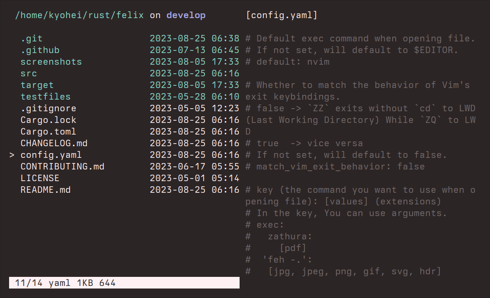

[](https://crates.io/crates/felix)


# _felix_



A tui file manager with Vim-like key mapping, written in Rust.\
Fast, simple, and easy to configure & use.

For the overview of this app, take a look at this README, especially
[key manual](#key-manual).\
For more detailed document, visit https://kyoheiu.dev/felix.

- [New release](#new-release)
- [Status](#status)
- [Installation](#installation)
- [Integrations](#integrations)
- [Usage](#usage)
  - [Key manual](#key-manual)
- [Preview feature](#preview)
- [Configuration](#configuration)

<a id="new-release"></a>

## New release

## v2.11.1 (2023-12-10)

### Fixed

- Allow SHIFT key to enter characters after `i`, `I`, `c`, `/`, `:` and `z`.

## v2.11.0 (2023-12-09)

### Added

- `<C-h>` for Backspace functionality after `i`, `I`, `c`, `/`, `:` and `z`.

## v2.10.2 (2023-11-26)

### Fixed
- Added a filter to every user input to reject `Keyup` events. This is required on the windows platform.


## v2.10.1 (2023-11-02)

### Fixed
- Convert tab to 4 spaces when using bat to preview text files.

## v2.10.0 (2023-11-01)

### Added
- `bat` integration: If `bat` installed, felix automatically adds syntax highlighting to the text preview.
  - Add `has_bat` field to `State`.
  - Add `FxError::InvalidPath` to handle invalid unicode in file path.

For more details, see `CHANGELOG.md`.

<a id="status"></a>

## Status

| OS      | Status               |
| ------- | -------------------- |
| Linux   | works                |
| NetBSD  | works                |
| MacOS   | works                |
| Windows | not fully tested yet |

_For Windows users: From v1.3.0, it can be at least compiled on Windows (see
`.github/workflows/install_test.yml`.) If you're interested, please try and
report any problems._

<a id="installation"></a>

## Installation

| package    | installation command  | notes                                                                                                                                       |
| ---------- | --------------------- | ------------------------------------------------------------------------------------------------------------------------------------------- |
| crates.io  | `cargo install felix` | Minimum Supported rustc Version: **1.67.1**                                                                                                 |
| Arch Linux | `pacman -S felix-rs`  | The binary name is `felix` if you install via pacman. Alias `fx='felix'` if you want, as this document (and other installations) uses `fx`. |
| NetBSD     | `pkgin install felix` |                                                                                                                                             |

### From this repository

- Make sure that `gcc` is installed.
- MSRV(Minimum Supported rustc Version): **1.67.1**

Update Rust if rustc < 1.67.1:

```
rustup update
```

```
git clone https://github.com/kyoheiu/felix.git
cd felix
cargo install --path .
```

<a id="integrations"></a>

## Integrations

### Exit to last working directory (LWD)
To export your LWD to the calling shell after exiting from `fx`,
add the following to your `.bashrc` or
`.zshrc` or an equivalent depending on your (POSIX) shell.  
***Assuming the `fx` binary can be found in your `PATH`.***

```sh
source <(command fx --init)
```

*If this is not set, exiting to LWD will fail and show the error message.*

### Others
In addition, you can use felix more conveniently by installing these apps:

- [zoxide](https://github.com/ajeetdsouza/zoxide): A smarter `cd` command, which
  enables you to jump to a directory that matches the keyword in felix.
- [chafa](https://hpjansson.org/chafa/): Terminal graphics for the 21st century,
  by which you can preview images in felix. _**chafa must be v1.10.0 or
  later.**_
- [bat](https://github.com/sharkdp/bat): A *cat(1)* clone. Add syntax highlighting to the text preview with bat.

These apps do not need any configuration to use with felix!

<a id="usage"></a>

## Usage

_If you install this app via pacman, the default binary name is `felix`._

```
`fx` => Show items in the current directory.
`fx <directory path>` => Show items in the directory.
Both relative and absolute path available.
```

### Options

```
`--help` | `-h` => Print help.
`--log`  | `-l` => Launch the app, automatically generating a log file in `{data_local_dir}/felix/log`.
`--init`        => Returns a shell script that can be sourced for shell integration.
```

<a id="key-manual"></a>

### Key manual

```
j / <Down>         :Go down.
k / <Up>           :Go up.
h / <Left>         :Go to the parent directory if exists.
l / <Right> / <CR> :Open item or change directory.
gg                 :Go to the top.
G                  :Go to the bottom.
z<CR>              :Go to the home directory.
z {keyword}<CR>    :Jump to a directory that matches the keyword.
                    (zoxide required)
<C-o>              :Jump backward.
<C-i>              :Jump forward.
i{file name}<CR>   :Create a new empty file.
I{dir name}<CR>    :Create a new empty directory.
o                  :Open item in a new window.
e                  :Unpack archive/compressed file.
dd                 :Delete and yank item.
yy                 :Yank item.
p                  :Put yanked item(s) from register zero
                    in the current directory.
:reg               :Show registers. To hide it, press v.
"ayy               :Yank item to register a.
"add               :Delete and yank item to register a.
"Ayy               :Append item to register a.
"Add               :Delete and append item to register a.
"ap                :Put item(s) from register a.
V (uppercase)      :Switch to the linewise visual mode.
  - y              :In the visual mode, yank selected item(s).
  - d              :In the visual mode, delete and yank selected item(s).
  - "ay            :In the visual mode, yank items to register a.
  - "ad            :In the visual mode, delete and yank items to register a.
  - "Ay            :In the visual mode, append items to register a.
  - "Ad            :In the visual mode, delete and append items to register a.
u                  :Undo put/delete/rename.
<C-r>              :Redo put/delete/rename.
v (lowercase)      :Toggle whether to show the preview.
s                  :Toggle between vertical / horizontal split in the preview mode.
<Alt-j>
 / <Alt-<Down>>    :Scroll down the preview text.
<Alt-k> 
 / <Alt-<Up>>      :Scroll up the preview text.
<BS>               :Toggle whether to show hidden items.
t                  :Toggle the sort order (name <-> modified time).
c                  :Switch to the rename mode.
/{keyword}         :Search items by a keyword.
n                  :Go forward to the item that matches the keyword.
N                  :Go backward to the item that matches the keyword.
:                  :Switch to the command line.
  - <C-r>a         :In the command line, paste item name in register a.
:cd<CR>            :Go to the home directory.
:cd {path}<CR>     :Go to the path.
:e<CR>             :Reload the current directory.
:trash<CR>         :Go to the trash directory.
:empty<CR>         :Empty the trash directory.
:h<CR>             :Show help.
:q<CR>             :Exit.
:{command}         :Execute a command e.g. :zip test *.md
<Esc>              :Return to the normal mode.
ZZ                 :Exit without cd to last working directory
                    (if `match_vim_exit_behavior` is `false`).
ZQ                 :cd into the last working directory and exit
                    (if shell setting is ready and `match_vim_exit_behavior is `false`).
```

<a id="preview"></a>

## Preview feature

By default, text files and directories can be previewed by pressing `v`.\
Install `chafa` and you can preview images as well.

<a id="configuration"></a>

## Configuration

### Config file

If any config file is not found, or found one is broken, felix launches with the default configuration, without creating new one.
Note that the default editor is `$EDITOR`, so if you've not set it, opening a file will fail.
You can find default config file (`config.yaml`) in this repository.

*Both `config.yaml` and `config.yml` work from v2.7.0*

### Trash directory and log file

Contrary to the config file, these directory and file will be automatically created.

### Linux

```
config file     : $XDG_CONFIG_HOME/felix/config.yaml(config.yml)
trash directory : $XDG_DATA_HOME/felix/Trash
log files       : $XDG_DATA_HOME/felix/log
```

### macOS

On macOS, felix looks for the config file in the following locations:

1. `$HOME/Library/Application Support/felix/config.yaml(config.yml)`
2. `$HOME/.config/felix/config.yaml(config.yml)`

```
trash directory : $HOME/Library/Application Support/felix/Trash
log files       : $HOME/Library/Application Support/felix/log
```

### Windows

```
config file     : $PROFILE\AppData\Roaming\felix\config.yaml(config.yml)
trash directory : $PROFILE\AppData\Local\felix\Trash
log files       : $PROFILE\AppData\Local\felix\log
```

### About `Rgb` and `AnsiValue`
You can configure these colors like this:
```
color:
  dir_fg: LightCyan
  file_fg: !AnsiValue 120
  symlink_fg: LightYellow
  dirty_fg: !Rgb [124, 30, 40]
```
cf: https://docs.rs/serde_yaml/latest/serde_yaml/#using-serde-derive

For more details, visit https://kyoheiu.dev/felix.
